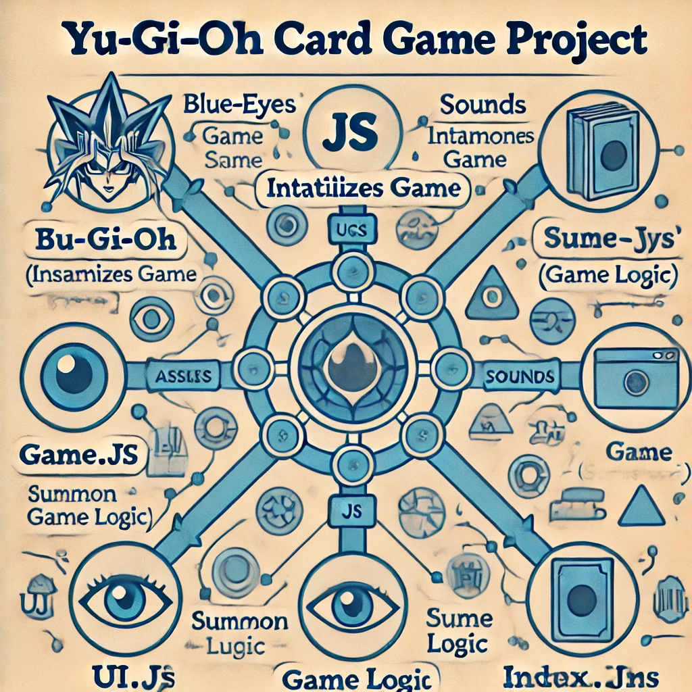

# Criando-um-Jogo-de-Cartas-do-Yu-Gi-Oh-com-JavaScript-e-CSS

[1]: https://www.youtube.com/watch?v=yRo_OivycEs ""
[2]: https://www.youtube.com/watch?v=Jo5vYNCOpf8 ""
[3]: https://www.youtube.com/watch?v=upbKr0LKw4g ""
[4]: https://github.com/BrunoDorea/jogoYuGiOh ""
[5]: https://github.com/harcanjo/dio-yugioh-js ""
[6]: https://github.com/crysthian/dio-YuGiOh-JoKenPo-game ""
[7]: https://www.dio.me/bootcamp/potencia-tech-ifood-desenvolvimento-de-jogos ""
[8]: https://produto.mercadolivre.com.br/MLB-854089957--500-protetores-sleeves-shields-magic-the-gathering-_JM?quantity=2 ""

Para criar um jogo de cartas do Yu-Gi-Oh! com mecânicas inspiradas no Jo-Ken-Po, podemos seguir estes passos detalhados:

Estrutura de Arquivos
Primeiro, vou estruturar o projeto de forma organizada, facilitando a compreensão e manutenção do código:

bash

1. HTML (index.html)
Esse arquivo define a estrutura básica do jogo. Vamos utilizar uma abordagem simples com um container para as cartas e os botões de controle.

html
<!DOCTYPE html>
<html lang="en">
<head>
    <meta charset="UTF-8">
    <meta name="viewport" content="width=device-width, initial-scale=1.0">
    <title>Yu-Gi-Oh! Card Game</title>
    <link rel="stylesheet" href="css/styles.css">
</head>
<body>
    <main class="game-container">
        <h1>Yu-Gi-Oh! Card Battle</h1>
        <!-- Contêiner para exibir as cartas -->
        <section id="card-container" class="card-container"></section>
        <!-- Botões de ação -->
        

            <button id="play" class="btn-play">Play</button>
            <button id="reset" class="btn-reset">Reset</button>
        

    </main>
    
</body>
</html>
2. CSS (styles.css)
Aqui está o estilo básico que torna o jogo visualmente atraente. Vamos utilizar Flexbox e Grid para organizar os elementos.

css

* {
    margin: 0;
    padding: 0;
    box-sizing: border-box;
}

body {
    font-family: Arial, sans-serif;
    background-color: #222;
    color: #fff;
    display: flex;
    justify-content: center;
    align-items: center;
    height: 100vh;
    text-align: center;
}

.game-container {
    display: flex;
    flex-direction: column;
    align-items: center;
    justify-content: center;
}

h1 {
    margin-bottom: 20px;
}

.card-container {
    display: grid;
    grid-template-columns: repeat(3, 1fr);
    gap: 20px;
    margin-bottom: 20px;
}

.actions {
    display: flex;
    gap: 10px;
}

.btn-play, .btn-reset {
    padding: 10px 20px;
    border: none;
    background-color: #00bfff;
    color: white;
    font-size: 16px;
    cursor: pointer;
    transition: background-color 0.3s ease;
}

.btn-play:hover, .btn-reset:hover {
    background-color: #1e90ff;
}
3. JavaScript Principal (main.js)
Esse arquivo é o ponto de entrada do jogo. Ele inicializa a interface e as funções do jogo.

javascript
Copiar código
import { startGame, resetGame } from './game.js';
import { setupUI } from './ui.js';

document.addEventListener('DOMContentLoaded', () => {
    setupUI();  // Configura a interface do usuário
    startGame();  // Inicia o jogo
});
4. Lógica do Jogo (game.js)
Aqui é onde a lógica do jogo reside. Vamos criar as cartas, gerenciar as jogadas e implementar a mecânica do Jo-Ken-Po, onde as cartas representam diferentes movimentos.

javascript
Copiar código
import { updateUI } from './ui.js';
import { shuffleArray } from './utils.js';

// Estado inicial do jogo
let gameState = {
    playerCard: null,
    computerCard: null,
    result: ''
};

// Função para iniciar o jogo
export const startGame = () => {
    const cards = ['rock', 'paper', 'scissors'];  // Exemplo de mecânica Jo-Ken-Po
    gameState.playerCard = null;
    gameState.computerCard = null;
    gameState.result = '';
    
    // Gerar cartas embaralhadas
    const shuffledCards = shuffleArray(cards);
    updateUI(shuffledCards, gameState);
};

// Função para verificar o vencedor com base nas cartas
const checkWinner = () => {
    const { playerCard, computerCard } = gameState;

    if (playerCard === computerCard) {
        return 'Draw';
    }
    if (
        (playerCard === 'rock' && computerCard === 'scissors') ||
        (playerCard === 'scissors' && computerCard === 'paper') ||
        (playerCard === 'paper' && computerCard === 'rock')
    ) {
        return 'Player Wins!';
    }
    return 'Computer Wins!';
};

// Função para resetar o jogo
export const resetGame = () => {
    gameState = {
        playerCard: null,
        computerCard: null,
        result: ''
    };
    startGame();  // Reinicia o jogo
};

// Função para fazer a jogada
export const makeMove = (playerCard) => {
    gameState.playerCard = playerCard;
    gameState.computerCard = ['rock', 'paper', 'scissors'][Math.floor(Math.random() * 3)];
    gameState.result = checkWinner();

    updateUI(null, gameState);
};
5. Interface do Usuário (ui.js)
Este arquivo cuida da interface do usuário, garantindo que ela seja atualizada conforme o estado do jogo muda.

javascript
Copiar código
import { makeMove, resetGame } from './game.js';

// Função para configurar a interface do usuário
export const setupUI = () => {
    const cardContainer = document.getElementById('card-container');
    const playButton = document.getElementById('play');
    const resetButton = document.getElementById('reset');
    
    playButton.addEventListener('click', () => {
        // Jogador escolhe carta
        cardContainer.addEventListener('click', (event) => {
            if (event.target.classList.contains('card')) {
                const playerCard = event.target.dataset.card;
                makeMove(playerCard);
            }
        });
    });

    resetButton.addEventListener('click', () => {
        resetGame();
    });
};

// Função para atualizar a UI com base no estado do jogo
export const updateUI = (cards, gameState) => {
    const cardContainer = document.getElementById('card-container');
    cardContainer.innerHTML = '';

    if (cards) {
        // Gerar cartas na tela
        cards.forEach(card => {
            const cardElement = document.createElement('div');
            cardElement.classList.add('card');
            cardElement.dataset.card = card;
            cardElement.innerHTML = card;
            cardContainer.appendChild(cardElement);
        });
    }

    // Exibir o resultado após a jogada
    if (gameState.result) {
        alert(`Result: ${gameState.result}`);
    }
};
6. Funções Utilitárias (utils.js)
Essa função utilitária embaralha as cartas para garantir que a distribuição seja aleatória.

javascript
Copiar código
export const shuffleArray = (array) => {
    for (let i = array.length - 1; i > 0; i--) {
        const j = Math.floor(Math.random() * (i + 1));
        [array[i], array[j]] = [array[j], array[i]];
    }
    return array;
};
Considerações Finais
Com essa estrutura, você tem um jogo de cartas do Yu-Gi-Oh! com mecânicas de Jo-Ken-Po, organizado e preparado para expandir com novos recursos, como diferentes níveis de dificuldade, efeitos sonoros e animações. A modularidade do código facilita a manutenção e futuras melhorias.

https://github.com/digitalinnovationone/js-yugioh-assets
